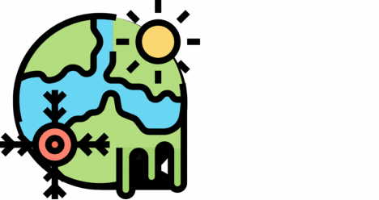

   

## ClimateCheck: Fact-Checking Social Media Posts About Climate Change Against Scholarly Articles

This repository contains code for creating the dataset and baseline for the ClimatCheck shared task, which consists of:

**Subtask I: English claims** \
Given a claim in English extracted from a social media platform about climate change: 
1. Find all relevant publications related to it from a pre-determined corpus of climate change research publications. 
2. For each of those, predict whether the publication supports, refutes, or does not have enough information about the claim.\
The predictions for each claim should be a list of related articles and their labels. 
	
**Subtask II: Cross-lingual using German claims** \
Given a claim in German extracted from a social media platform about climate change: 
1. Find all relevant English publications related to it from a pre-determined corpus of climate change research publications. 
2. For each of those, predict whether the publication supports, refutes, or does not have enough information about the claim. \
The predictions for each claim should be a list of related articles and their labels. 

### Claims

#### English claims

Claims in English are gathered from the following resources:
1. [ClimaConvo](https://github.com/shucoll/ClimaConvo): A dataset of tweets that was used to analyse public discourse on climate change. Tweets were retrieved and filtered to those containing scientific claims using a [claim detection model](https://huggingface.co/climatebert/environmental-claims) based on ClimateBERT. A final manual review was conducted to validate the results.  
2. [MultiFC](https://www.copenlu.com/publication/2019_emnlp_augenstein/): A publicly available dataset of naturally-occurring claims from fact-checking websites. Filtered to claims about climate change using a list of keywords and by checking the original source of the claim. 
3. [ClimateFeedback.org](https://science.feedback.org/climate-feedback/): A fact-checking website of climate change-related claims. 
4. [ClimateFEVER](https://huggingface.co/datasets/tdiggelm/climate_fever): A dataset of climate change-related claims gathered from news articles and linked to Wikipedia articles as evidence. 
5. [DEBAGREEMENT](https://datasets-benchmarks-proceedings.neurips.cc/paper_files/paper/2021/hash/6f3ef77ac0e3619e98159e9b6febf557-Abstract-round2.html): The r/climate subset of the DEBAGREEMENT dataset which contains Reddit posts and replies dealing with climate change. A [claim detection model](https://huggingface.co/climatebert/environmental-claims) based on ClimateBERT and manual review were used to filter relevant claims.
   
#### German claims

Claims in German are gathered from the following resources:
1. [GerCCT](https://github.com/RobinSchaefer/GerCCT): A corpus of German tweets about climate change. Filtered to tweets annotated as 'claim' and reviewed manually to check whether they are scientific claims.  
2. [Correctiv Faktencheck](https://correctiv.org/faktencheck/klima/): 50 frequent claims fact-checked about climate change. 
3. [Klimafakten.de](https://www.klimafakten.de/): An online magazine on German-language communication about climate change. Contains frequent fact and (mis-)information on the matter. 
4. [r/Klimawandel](https://www.reddit.com/r/Klimawandel/): A German-language subreddit discussing issues surrounding climate change. Scraped posts and comments using the Reddit API from the last two years and filtered according to a list of keywords. 

For both English and German claims, texts originating from sources other than social media (i.e. MultiFC, ClimateFeedback.org, ClimateFEVER, Correctiv Faktencheck, and Klimafakten.de) were rephrased as tweets by prompting the [Gemini API](https://ai.google.dev/). The generated tweets were evaluated based on similarity to the original claim using BERTScore, fluency using perplexity, and style quality using a text style classifier ([English](https://huggingface.co/rabuahmad/tweet-style-classifier) and [German](https://huggingface.co/rabuahmad/tweet-style-classifier-de)). 

TBD - Process of getting atomic claims. 

### Publications

TBD

### Pairing claims and publications

TBD
